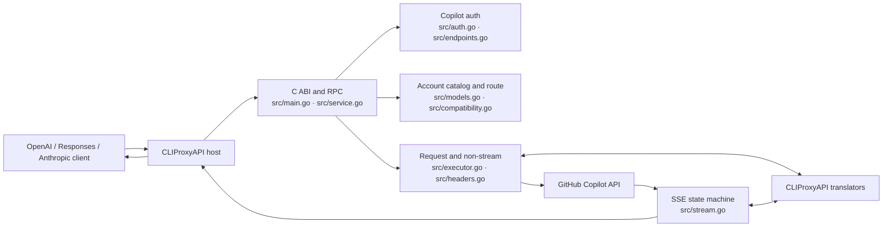
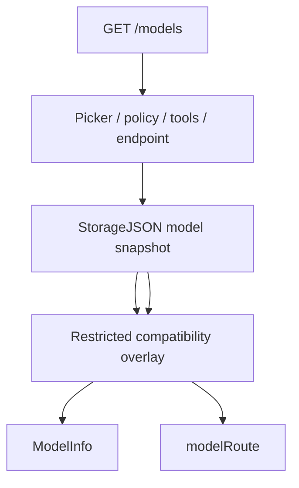

# 当前 GitHub Copilot 插件实现与代码架构

<!-- architecture-baseline
verified_at: 2026-08-07T10:34:19Z
plugin_revision: c4b9392f4b9e9cd96180ff68abf39f1d0733eb6c
cliproxyapi_revision: 9e9230a19efc555375416d49577cdc9bcd2cc9a6
vscode_tag: 1.132.0
vscode_revision: df53daabb18cd157bdb08c7f01c34df936cf12f4
copilot_chat_version: 0.60.0
copilot_api_package: 0.4.3
review: GPT-5.6 Terra final APPROVE
plugin_worktree: dirty (implementation and documentation under review)
cliproxyapi_worktree: clean
-->

## 1. 范围与事实来源

本文描述当前 Go `c-shared` 插件的可执行行为。GitHub Copilot wire contract 以 VS Code `1.132.0` 的内置 Copilot Chat `0.60.0` 和 `@vscode/copilot-api@0.4.3` 为上游实现基线；`pi` 仅保留为旧凭据字段迁移背景，不再决定身份、请求 body、header、路由或终态语义。

插件不是聊天客户端。它按单次 `ExecutorRequest` 工作，不保存 conversation history，也不替客户端选择或重放 Responses continuation。CLIProxyAPI 宿主负责公共 API、凭据持久化、刷新调度、HTTP transport、下游连接和通用 translator；插件只负责 GitHub Copilot 认证、账户模型路由和 provider wire compatibility。

## 2. 总体架构



### 2.1 模块职责

| 模块 | 直接决定的行为 |
|---|---|
| `src/main.go` | ABI v1 初始化、call/free/shutdown、envelope、panic 隔离 |
| `src/service.go`、`src/types.go` | capability 注册、RPC dispatch、配置、登录 session 和 route cache |
| `src/host.go` | 唯一的上游 HTTP、stream 和日志 callback 封装 |
| `src/auth.go` | Device Flow、broker exchange、刷新、凭据解析和 legacy 字段迁移 |
| `src/endpoints.go` | GitHub host、token `proxy-ep`、same-origin 和 canonical inference path 校验 |
| `src/models.go` | `/models` schema、资格过滤、能力传播、endpoint 和 route 选择 |
| `src/compatibility.go`、`src/compatibility.json` | 受限兼容覆盖、ETag/TTL、严格 schema |
| `src/headers.go` | VS Code 1.132 身份、请求关联、受控 interaction/initiator、Anthropic beta |
| `src/executor.go` | 请求转换、协议 normalizer、raw HTTP、非流终态验证 |
| `src/stream.go` | SSE framing、source terminal 认证、转换、错误优先级和关闭 |
| `src/logging.go` | 结构化日志、字段和值级脱敏 |

## 3. 宿主与插件边界

| 关注点 | 插件负责 | CLIProxyAPI 负责 |
|---|---|---|
| 公共协议 | 声明 `openai`、`openai-response`、`claude` 输入输出 | 暴露 `/v1/chat/completions`、`/v1/responses`、`/v1/messages` |
| 认证 | GitHub Device Flow、Copilot session exchange、刷新结果 | 凭据文件、刷新调度和并发控制 |
| 模型 | 账户 `/models`、过滤、能力快照和上游 route | 聚合模型、选择 auth 和 executor |
| 请求转换 | 选择转换方向并执行 Copilot 后处理 | translator registry 和具体转换器 |
| HTTP | URL、headers、body、status 和 provider 校验 | transport、代理、连接和 request context |
| streaming | SSE frame、转换状态、terminal 认证、emit/close | 上游读取 callback 和下游连接 |

当前 route matrix：

| 客户端格式 | Chat 模型 | Responses 模型 | Messages 模型 |
|---|---|---|---|
| OpenAI Chat | 原生 | Chat → Codex/Responses | Chat → Anthropic |
| OpenAI Responses | Responses → Chat | 原生 | Responses → Anthropic |
| Anthropic Messages | Anthropic → Chat | Anthropic → Codex/Responses | 原生 |

普通内容可以转换，但 opaque Responses state 不能假定可逆。请求含 `previous_response_id`、非空 `context_management`、`compaction` item 或带 encrypted content 的 reasoning item 时，source、output、upstream 和 translator format 必须全部是原生 `openai-response`，否则在发请求前以 `format_mismatch` fail closed。

## 4. 认证与信任边界

```text
GitHub access token
  -> GET /copilot_internal/v2/token
  -> Copilot session token
  -> 校验 token 中 proxy-ep
  -> 推导可信 API base URL
  -> GET /models
  -> 推理请求
```

安全约束：

- 所有上游操作都通过 `hostClient`；生产代码不创建独立 `http.Client`。
- `github_host` 只接受 HTTPS DNS host；拒绝 userinfo、port、path、IP、localhost 和单标签主机。
- token 中 `proxy-ep` 只接受 GitHub Copilot 或配置 Enterprise host 的可信 suffix。
- raw HTTP 只能访问当前凭据 API base URL 的 HTTPS same-origin。
- inference path 必须是无 query/fragment 的 canonical path，且只能使用 `POST`。
- token、Authorization、`RawJSON`、`StorageJSON`、device/user code 和上下游正文不得进入日志或错误。

## 5. 模型发现与能力传播



选择规则：

1. 接受 `model_picker_enabled == true` 且 policy 不是 disabled 的模型。
2. Individual endpoint 在 picker 为空时可回退到 `policy.state == enabled`。
3. 排除明确 `tool_calls == false` 的模型。
4. 声明了 `supported_endpoints` 时，必须包含 `/chat/completions`、`/responses` 或 `/v1/messages`。
5. 只有未声明 endpoint 时才按模型 ID 做 legacy 推断。
6. 已有非空 snapshot 但找不到模型时直接拒绝，不按名称猜测。
7. manifest 只能覆盖账户已发现的同 ID 模型和 schema 白名单字段。

discovery 会把 family、prompt/output limit、vision、reasoning levels及 nullable `streaming`、`tool_search`、`context_editing` 保存到 route。缺失 optional capability 按关闭处理；只有显式 `streaming:true` 才发布 stream capability 并允许 `ExecuteStream`。

## 6. VS Code 1.132 HTTP 身份与请求上下文

固定且不可由 caller 或 compatibility manifest 覆盖：

```http
User-Agent: GitHubCopilotChat/0.60.0
Editor-Version: vscode/1.132.0
Editor-Plugin-Version: copilot-chat/0.60.0
Copilot-Integration-Id: vscode-chat
X-GitHub-Api-Version: 2026-06-01
```

每次推理生成 RFC 4122 v4 UUID，并设置：

```http
X-Request-Id: <request-uuid>
X-Agent-Task-Id: <same-request-uuid>
X-Interaction-Id: <valid-caller-uuid-or-request-uuid>
X-Interaction-Type: <controlled-vocabulary>
Openai-Intent: <same-controlled-value>
X-Initiator: user|agent
```

`X-Interaction-Type` 只接受 VS Code 1.132 的固定词表；缺省按公共输出协议回退为 `responses-proxy`、`messages-proxy` 或 `conversation-other`。`X-Initiator` 只接受 `user|agent`，否则才从最后一个 `messages`/`input` role 推断。插件不伪造 VS Code runtime 的 machine/session/device ID 或 fetcher library version。

vision header 同时要求 route 支持 vision 且 payload 含 image。Anthropic beta 不透传任意 caller 值，只按 route capability 和 body 证据生成 pinned 源码中的四个 beta；不发送 `Anthropic-Version`。

## 7. 请求 body 契约

| 协议 | 当前后处理 |
|---|---|
| Chat Completions | 固定 model/stream；删除 `store`；只有 route 声明对应 level 时保留 `reasoning_effort`；developer role 改 system |
| Responses | 固定 `store:false`；缺省 `truncation:disabled` 与 encrypted reasoning include；清理空 reasoning；GPT-5 minimal 改 low；按 policy 注入 context management |
| Messages | 缺省 `max_tokens:4096`；删除 `stream_options`；按能力处理 thinking、temperature、system、tool schema/ID、context management、effort 和 eager tool input |

caller 已提供合法 `truncation`、`include` 或 `context_management` 时不会被默认值覆盖。Chat 与 Messages 的特殊规则由 discovery/compatibility route 能力驱动，不把所有模型行为硬编码到 ID。

## 8. Responses compaction 与 continuation

`enable_responses_context_management` 默认开启。只有原生 Responses route、family 非空且不属于 `gpt-5`、`gpt-5.1`、`gpt-5.2` 时，缺省请求加入：

```json
{
  "context_management": [
    {"type": "compaction", "compact_threshold": 90000}
  ]
}
```

阈值为：

$$
\text{compactThreshold}=\left\lfloor0.9\times\text{MaxPromptTokens}\right\rfloor
$$

prompt window 无有效值时回退 `50000`。配置开关关闭、excluded family 或 caller 已给出 context management 时不注入默认值。

插件保持 stateless：

- 原样转发 compaction output events 和 native terminal output。
- 原样保留下一轮客户端提交的 compaction item、encrypted content、`previous_response_id` 和顺序。
- latest-item 选择、history slicing、去重和下一轮重放由 Responses 客户端完成。
- 测试客户端已覆盖“首轮事件 → latest selection → 下一轮 opaque input”闭环。
- 独立 `/responses/compact` 没有 pinned provider 证据；`ExecutorRequest.Alt == "responses/compact"` 和 raw `/responses/compact` 都在 host HTTP 前返回 `unsupported_feature`（501）。

## 9. 非流响应终态

原生 Responses 的成功 HTTP body 必须满足精确终态语法：

- bare `object:"response"` 的 `status` 只能是 `completed`、`incomplete` 或 `failed`；
- `incomplete` 必须有 `max_output_tokens` 或 `content_filter` reason；
- `failed` 必须有非空 error object；completed 不能带非空 error 或 incomplete details；
- `response.completed`、`response.incomplete`、`response.failed` typed wrapper 必须带 nested Response，且 event type 与其结构化终态精确一致；wrapper 外层不能再带 object/status/error；
- standalone error 可写成 `{"type":"error","error":{...}}` 或 `{"error":{...}}`；error object 必须非空，且 envelope 不能同时带 response/object/status；
- 判别值大小写和空白不做归一，未知、矛盾、缺失或非字符串值均拒绝；
- token scanner 在 map 解码前递归拒绝任意对象的重复 JSON key，包括转义后等价 key；
- malformed、trailing JSON、无终态和 `in_progress` 都返回通用 `upstream_protocol_error`。

合法 native terminal payload 不重编码，按原字节返回。Chat/Claude 转 Responses 前先验证 source error/stop reason：Chat `length` 映射为 `max_output_tokens`，`content_filter` 保留；Claude `max_tokens` 与 `model_context_window_exceeded` 映射为 `max_output_tokens`。source failed/error 在 translator 生成任何成功外观前被拒绝，错误和日志不包含上游正文。

canonical raw `POST /responses` 且 `stream:false` 使用同一 validator；raw `stream:true` 是 SSE body，明确跳过非流 JSON 终态校验。

## 10. Streaming 终态

相同格式按完整 SSE frame 透传，跨格式按 event 分帧并维持 translator state。单个未完成 event 默认最多 4 MiB，可配置为 64 KiB 到 64 MiB。

Responses 输出只有看见真实 `response.completed`、`response.incomplete`、`response.failed` 或 `error` 才能正常关闭。普通 EOF 或只有 `[DONE]` 不构成终态，返回 `missing_terminal_event`，且绝不合成 response ID 或 completed event。

跨格式 source terminal 优先级为：

$$
\text{failed/error} > \text{incomplete} > \text{completed}
$$

后到的强状态覆盖先到的弱状态。translator 生成的 completed 只有被 source completed 授权才可发出；source incomplete 会把它改写为带原始 reason 的 incomplete；任何 late error 都覆盖此前 finish。

## 11. Raw HTTP、错误与日志

`ProviderExecutor.HttpRequest` 对同源非推理请求保持 method、URL 和 body bytes，不应用 inference normalizer；Authorization、identity 和受控 metadata 仍由插件重新构造。对三条 inference path 则执行 method、canonical path、model route、stream capability 和 body policy。成功的非流 raw Responses 还执行第 9 节终态验证。该入口不能绕开 normal executor 的 provider 安全契约。

日志只记录 model、route、状态、受控 identifier、字段 presence、threshold、event type、byte count 和耗时。敏感 key、token-like value、header/body/payload/content 字段会被过滤，字符串最长 256 bytes。上游 body 不进入 `pluginFailure`。

## 12. 已验证范围与有意不支持

真实 c-shared integration 通过 CLIProxyAPI loader 和 callback machinery 执行注册、auth/model ownership、`Execute`、`ExecuteStream` 和 `HttpRequest`，并验证身份头、Responses 转换、incomplete reason、raw duplicate-key 终态拒绝及错误哨兵脱敏。

验证 gate：

```bash
make test
make vet
go test -race ./...
make integration
test -z "$(gofmt -d src/*.go)"
git diff --check
```

有意不支持或不移植：

- token counting；
- 独立 `/responses/compact`；
- VS Code WebSocket transport；
- VS Code UI、telemetry、agent tool loop；
- plugin-side conversation history、compaction selection 或 continuation persistence；
- 无法由代理真实提供的 VS Code runtime identity。