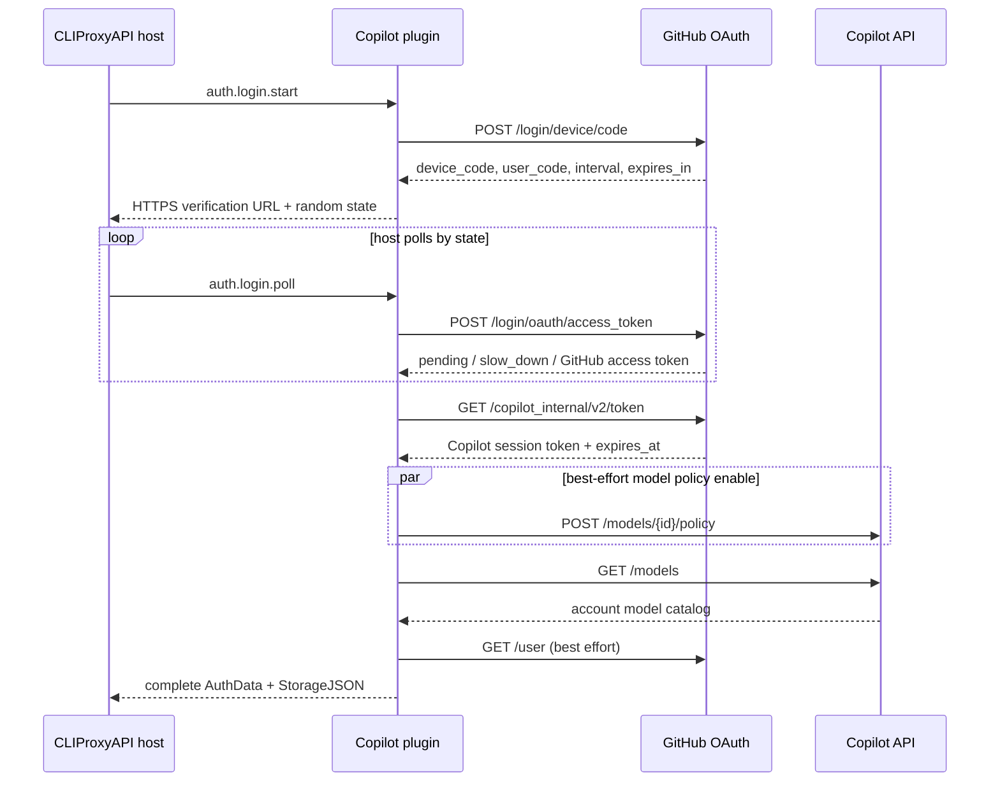

# GitHub Copilot 技术路线、架构与 pi 实现对比

<!-- sync-baseline
document_version: 1
verified_at: 2026-08-06
plugin_revision: bd9930d26ab4128483a0d4f681557f9ad2f7913f
plugin_worktree: clean before this document was added
pi_revision: 5e69d85050f2d6d529cc1840138b34a773352ae1
pi_worktree: clean
pi_previous_analysis_revision: cb88d95b2
cliproxyapi_revision: ea37d13a9eced4af835cad10bcb030d770a5ba88
cliproxyapi_worktree: clean
pi_catalog_generated_at: 2026-08-06T04:34:35.467Z
pi_catalog_file_sha256: 5309ca8beea37d314d9f0610431f11196d1893a61859233f2e3ee3212ae4352f
-->

## 1. 目标、范围与基线

本文说明当前 Go `c-shared` 插件如何把 GitHub Copilot 订阅接入 CLIProxyAPI，并与相邻 `../pi` 项目的当前实现进行对照。它用于回答三个问题：

1. 两个项目共同依赖的 GitHub Copilot 协议和生命周期是什么。
2. `pi` 的能力在本项目中由哪个模块实现，哪些职责改由 CLIProxyAPI 宿主承担。
3. `pi` 代码变化后，如何快速判断本项目是否需要同步，以及如何验证同步结果。

本次对比基线：

| 对象 | revision / 数据版本 | 状态 |
|---|---|---|
| 当前插件 | `bd9930d26ab4128483a0d4f681557f9ad2f7913f` | 创建本文前工作树干净 |
| `../pi` | `5e69d85050f2d6d529cc1840138b34a773352ae1` | 工作树干净 |
| `../CLIProxyAPI` | `ea37d13a9eced4af835cad10bcb030d770a5ba88` | 工作树干净 |
| `pi` 内置模型数据 | `2026-08-06T04:34:35.467Z` | `github-copilot.json` SHA-256 见顶部元数据 |
| 插件内置兼容清单 | `2026-08-06T00:00:00Z` | 29 个模型 |

`../pi/github-copilot-imp.md` 最后标注的源码基线是 `cb88d95b2`。从该 revision 到当前 `pi` HEAD，Copilot 相关变化是 `generate-models.ts` 将 Fable 5 改走 Anthropic Messages，并新增对应回归测试；OAuth、headers 和三协议 adapter 主流程没有变化。该分析仍可作为背景材料，但其 Fable 路由结论必须按当前源码修正；本文始终以当前源码、生成数据和测试为事实来源。

## 2. 核心结论

两个项目共享同一条外部协议主线：

```text
GitHub Device Flow
  -> 长期 GitHub access token
  -> GET /copilot_internal/v2/token
  -> 短期 Copilot session token
  -> 从 token 的 proxy-ep 推导 API base URL
  -> GET /models 获取账户可用模型
  -> 按模型选择 /chat/completions、/responses 或 /v1/messages
```

但当前插件不是 `pi` runtime 的 Go 版移植：

- `pi` 是完整 TypeScript 应用，自行负责凭据文件、跨进程锁、OAuth 双重检查刷新、模型目录、Provider 组合和三种协议客户端。
- 当前项目是 CLIProxyAPI 原生插件，只实现 Copilot 专属领域逻辑。持久化与刷新调度、HTTP transport、下游 stream、公共 API 入口和通用格式翻译分别由 CLIProxyAPI 宿主及 SDK 承担。
- `pi` 以静态/远端模型目录定义协议和能力，再用账户 `/models` 的 ID 集合做过滤；插件直接保存 `/models` 的 endpoint 和 capability 快照，再叠加受限的 `compatibility.json`。
- 因此同步 `pi` 时应比较外部协议、模型 ID、模型兼容元数据、payload/header 规则和事件语义，不应机械复制 `pi` 的 UI、文件存储或 Provider composition。

## 3. 当前项目技术路线与架构

### 3.1 交付形态与依赖边界

- Go 1.26、CGO、`-buildmode=c-shared`，通过 CLIProxyAPI ABI v1 动态装载。
- `go.mod` 开发期用 `replace` 固定到相邻 `../CLIProxyAPI`，因此 ABI、`pluginapi` 类型和 translator 行为都受宿主 revision 影响。
- 插件同时注册 `auth_provider`、`model_provider` 和 OAuth scope `executor`。
- 输入、输出格式均声明为 `openai`、`openai-response`、`claude`；具体上游格式由账户模型决定。
- `model.static` 返回空目录。模型只有绑定 OAuth 凭据并完成账户发现后才可见。
- token count 不支持；raw HTTP capability 只允许访问当前凭据解析出的 Copilot API 同源地址。
- 所有网络请求必须经过 `hostClient`，项目中不持有独立 `http.Client`。

### 3.2 模块分工

```text
CLIProxyAPI host
  +-- plugin loader / C ABI lifecycle
  +-- auth file persistence and refresh scheduling
  +-- public OpenAI / Anthropic endpoints
  +-- HTTP, proxy, request context and stream callbacks
  +-- sdk/translator built-in conversions
  |
  `-- github-copilot plugin
        +-- ABI entry and envelope ---------- main.go
        +-- capability registration/dispatch  service.go, types.go
        +-- typed host callback wrappers ----- host.go
        +-- Device Flow/session lifecycle ---- auth.go
        +-- trusted endpoint derivation ------ endpoints.go
        +-- account catalog/model routes ----- models.go
        +-- constrained compatibility overlay  compatibility.go/json
        +-- Copilot headers ------------------ headers.go
        +-- request shaping/non-stream ------- executor.go
        +-- SSE framing/stream translation --- stream.go
        `-- structured redacted logging ------ logging.go
```

| 文件 | 直接决定的行为 |
|---|---|
| `main.go` | C ABI init/call/free/shutdown、panic 隔离、host callback envelope |
| `service.go`、`types.go` | 配置、capability、RPC dispatch、服务内 session/route 状态 |
| `host.go` | `host.http.*`、`host.stream.*` 的唯一插件侧调用入口 |
| `auth.go` | 凭据 schema、legacy 迁移、登录状态机、broker exchange、刷新 |
| `endpoints.go` | GitHub Enterprise 规范化、`proxy-ep` 信任校验、same-origin |
| `models.go` | `/models` 解析、账户过滤、endpoint 选择、模型能力映射、policy enable |
| `compatibility.go`、`compatibility.json` | 内置/远端兼容规则、严格 schema、ETag/TTL、字段白名单 |
| `headers.go` | 静态身份头、动态 Copilot 头、Anthropic beta 选择 |
| `executor.go` | 格式选择、translator 调用、payload 后处理、非流与 raw HTTP |
| `stream.go` | SSE 分帧、透传/转换、缓冲上限、stream 清理和错误分类 |
| `registry.json` | CLIProxyAPI Plugin Store 发布登记；不是模型目录 |

### 3.3 插件与宿主责任边界

| 关注点 | 插件负责 | CLIProxyAPI 宿主 / SDK 负责 |
|---|---|---|
| OAuth | Device Flow、broker exchange、刷新结果和下次刷新时间 | 凭据落盘、触发/串行化 refresh、管理 API |
| HTTP | URL、headers、body、响应校验和错误分类 | transport、代理、连接生命周期、host callback context |
| 模型 | 账户发现、路由、能力和兼容覆盖 | 聚合 `/v1/models`、按 auth 选择模型 |
| 格式 | 选择源/目标格式并做 Copilot 后处理 | 通用 request/response/stream translator |
| 流 | SSE framing、translator 状态、emit/close 策略 | 上游读取桥、下游连接和 stream ID 生命周期 |
| 日志 | 只生成脱敏结构化事件 | 日志落地、request ID 和整体日志策略 |

边界判断原则：如果 `pi` 的变化属于 GitHub/Copilot 协议，应检查插件；如果属于文件锁、应用 UI、Provider 插件系统，应先检查 CLIProxyAPI 是否已有等价职责，不直接复制到本插件。

### 3.4 登录链路



关键实现选择：

1. ABI 将登录拆为 `start`/`poll`，而不是在一次调用内阻塞等待用户。
2. 插件生成 256 bit 随机 state，只把 device code 和临时 GitHub token 放在内存 session 中。
3. 最多保留 256 个待处理 session；同一 session 的重复并发 poll 会被抑制。
4. 首次 poll 必须等待服务端 interval；支持 `authorization_pending`、服务端 interval 版和本地 `+5s` 版 `slow_down`。
5. retryable transport/5xx 会在 session 有效期内重新调度；拒绝、过期和不可恢复响应会清理 secret。
6. verification URL 必须是配置 GitHub host 上的 HTTPS URL；URL 中预填 `user_code`。
7. policy enable 默认开启，固定 4 个 worker，单模型失败不阻断登录。
8. `/models` 是登录完成条件；GitHub account 查询只用于非敏感 label，失败不阻断。

### 3.5 两级令牌和刷新

| 数据 | 用途 | 生命周期/处理 |
|---|---|---|
| GitHub access token | 访问 Copilot token broker 和 GitHub `/user` | 长期保存，只放在 `StorageJSON` |
| Copilot session token | `/models`、policy 和推理 Bearer token | broker 给出真实 `expires_at` |
| `refresh_after` | 告诉宿主何时刷新 | 默认真实到期前 10 分钟 |
| `expires_at` | 硬过期边界 | 到期后推理直接返回 `reauth_required` |

插件还向宿主暴露 15 分钟的 refresh 检查间隔元数据。刷新过程是：

```text
旧 StorageJSON
  -> 用 GitHub token 换新 Copilot session
  -> 尝试 GET /models
      -> 成功：保存新 session + 新模型快照
      -> 失败：保存新 session + 原样复制旧模型状态（可以为空）
  -> 返回完整替换 AuthData
```

broker exchange 失败时不返回部分凭据，宿主保留旧值。模型发现失败时则接受已经校验的新 session，并无条件复制旧 `Models` 和 `ModelsFetchedAt`；即使旧模型状态为空，refresh 仍成功，后续 `model.for_auth` 再尝试发现。该语义以 `refreshAuth` 和对应测试为准。

### 3.6 凭据结构与 pi legacy 迁移

核心 `copilotStorage` 字段：

| 字段 | 含义 |
|---|---|
| `type` | 固定 `github-copilot` |
| `github_access_token` | 长期 GitHub 凭据 |
| `copilot_session_token` | 短期模型 API 凭据 |
| `refresh_after` / `expires_at` | 提前刷新时间 / 真实硬过期时间，毫秒 |
| `github_host` / `api_base_url` | 配置身份与派生结果；有效 base URL 每次仍从 token 重新校验 |
| `account` | GitHub login 或非敏感 fallback ID |
| `models` / `models_fetched_at` | 账户模型、endpoint、能力和目录时间 |
| `compatibility_manifest` / `*_checked_at` / `*_etag` | 受限远端兼容缓存 |

解析器直接接受旧 `pi` 风格字段：

| pi legacy | 当前字段/行为 |
|---|---|
| `refresh` | `github_access_token` |
| `access` | `copilot_session_token` |
| `expires` | `refresh_after` |
| `enterpriseUrl` | 规范化后写入 `github_host` |
| `availableModelIds` | 迁移成只含 ID 和推断格式的 `models` |

token 不会复制到 Metadata、Attributes、label 或错误文本。宿主文件仍是明文凭据，因此文件权限与备份安全属于部署责任。

### 3.7 Endpoint 与信任边界

- `github_host` 只能是 HTTPS DNS hostname，拒绝 userinfo、port、path、query、fragment、IP、localhost 和单标签主机。
- GitHub.com broker 固定为 `https://api.github.com/copilot_internal/v2/token`；Enterprise 使用 `https://api.<host>/...`。
- session token 的 `proxy-ep` 必须是合法 hostname，并属于 `*.githubcopilot.com` 或配置 GitHub host 的后缀；只转换开头的 `proxy.` 为 `api.`。
- 无可信 `proxy-ep` 时，GitHub.com 回退到 Individual endpoint，Enterprise 回退到 `https://copilot-api.<host>`。
- raw HTTP executor 额外执行 HTTPS same-origin 校验，防止把 session Bearer token 转发到任意 URL。
- 上游错误正文不进入插件错误或日志；响应给客户端的 headers 也只保留 content type、request ID 和 retry-after 等白名单。

### 3.8 模型目录、兼容层与路由

插件有四个容易混淆的数据层：

| 数据层 | 作用 | 是否决定对外模型 |
|---|---|---|
| Copilot `GET /models` | 账户资格、endpoint、上下文/输出限制、vision/reasoning 能力 | 是，主事实来源 |
| `knownCopilotModels` | 登录后尝试启用 policy 的 ID 列表 | 否，仅 policy enable |
| `compatibility.json` | 修正 `/models` 不足或已知兼容差异 | 只能覆盖已发现的同 ID 模型 |
| `(auth_id, model_id)` 内存 route cache | 避免后续请求丢失已解析路由 | 否，派生缓存 |

账户资格过滤的核心规则与 `pi` 相同：

- `model_picker_enabled == true`；
- `policy.state != disabled`；
- `capabilities.supports.tool_calls != false`。

插件还多做一层可路由性过滤：声明了 endpoint 的模型必须至少包含 `/chat/completions`、`/responses` 或 `/v1/messages` 之一；完全未声明 endpoint 时才按 ID 安全推断。`pi` 的 `/models` 解析不检查 `supported_endpoints`，只提取通过资格过滤的 ID，再与自身静态/远端目录求交集。

Individual endpoint 在 picker 结果为空时回退到 `policy.state == enabled`；Business/Enterprise 保持严格 picker 语义。合法空目录表示账户确实没有模型，后续不能按名称猜测；过期的非空目录刷新失败时可使用 stale cache。

路由优先级：

1. 找到凭据中同 ID 的账户模型。
2. 如启用远端兼容且 `StorageJSON` 已持久化有效 manifest，对该 stored model 应用 fixed-enum format 和能力覆盖。
3. 使用 stored model 在发现阶段由 `/models.supported_endpoints` 选出的 format 构造固定路径。
4. 凭据已有任意模型快照却找不到请求模型时直接拒绝，不做名称推断。
5. legacy 凭据完全没有模型状态时，才查 per-auth cache，最后保守按 ID 推断。
6. `claude-fable-5` 有显式迁移保护，始终走 Anthropic Messages。

格式映射：

| 插件格式 | 上游路径 | 默认模型族 |
|---|---|---|
| `openai` | `/chat/completions` | GPT-4.1、Gemini、Kimi 等 |
| `openai-response` | `/responses` | GPT-5、Grok 4.5、OSWE、MAI |
| `claude` | `/v1/messages` | Claude Haiku/Sonnet/Opus/Fable 4/5 |

`compatibility.json` 随二进制内嵌，并可从本项目固定 GitHub Raw URL 刷新。默认 TTL 4 小时，支持 ETag/304；远端 `generated_at` 不能早于内置版本。解析器限制 1 MiB、schema version、模型数、格式枚举、数值范围和 header 白名单。schema 允许覆盖 format、context window、max tokens、thinking levels、adaptive/temperature/eager/xhigh 兼容和四个静态身份头，但不能控制 origin、任意 path、Authorization、Host 或 request body；`name`、cost、base URL 等字段也不参与请求控制。

应用路径需要特别区分：`model.for_auth` 会把本次选中的远端、缓存或内置 manifest 应用到对外 `ModelInfo` 和内存 route cache；真正执行请求时，如果 `StorageJSON` 已含同 ID model，`resolveModelRoute` 只会重新应用凭据中已持久化的有效 manifest，并在命中 stored model 后跳过 route cache。因此新的请求路由修复不能只写进内置 JSON 后假设 executor 必然采用，还应覆盖请求路径，或像 Fable 一样提供代码级 legacy fallback。

### 3.9 推理与 payload 适配

```text
ExecutorRequest
  -> 校验 StorageJSON、真实过期时间、GitHub host
  -> 解析 model + source/output format
  -> 解析账户 modelRoute
  -> SDK TranslateRequest（如需要）
  -> Copilot route-specific JSON normalization
  -> headers + host.http.do[_stream]
  -> SDK TranslateNonStream / TranslateStream（如需要）
  -> ExecutorResponse / host.stream.emit
```

当 Responses 上游接收非 Responses 输入时，插件使用 SDK 的 Codex 中间格式，以匹配 CLIProxyAPI translator registry 的注册方向。

主要后处理：

| 上游协议 | 插件补充的 Copilot 兼容处理 |
|---|---|
| OpenAI Chat | 强制 model/stream；删除 `store`、`reasoning_effort`；把 `developer` role 改为 `system` |
| OpenAI Responses | 强制 `store:false`；删除空/`none`/`off` reasoning；GPT-5 的 `minimal` 改为 `low` |
| Anthropic Messages | 默认 `max_tokens:4096`；清理 `stream_options`；adaptive/budget thinking 双向归一；修正 temperature、system blocks、context management、tool schema 和 eager input streaming |

非流响应在 translator format 与客户端 output format 不同时转换。Responses 非流裸 response object 会先包装为 `response.completed`/`response.incomplete` event，供 SDK translator 消费。

### 3.10 Headers

四个固定身份头与当前 `pi` 一致：

```http
User-Agent: GitHubCopilotChat/0.35.0
Editor-Version: vscode/1.107.0
Editor-Plugin-Version: copilot-chat/0.35.0
Copilot-Integration-Id: vscode-chat
```

两边的 `/models` 发现请求都带 `X-GitHub-Api-Version: 2026-06-01`；插件还把该版本头统一加到推理请求，而 `pi` 当前生成的模型静态 headers 只有上面四项。

推理动态头：

- `Openai-Intent: conversation-edits`；
- 最后一条 `messages`/`input` role 为 user 时 `X-Initiator:user`，否则为 `agent`；
- 任意嵌套内容包含 image/image_url/input_image 时加 `Copilot-Vision-Request:true`；
- Anthropic route 根据模型、thinking 和 tools 选择 beta；
- 只允许调用方提供受控的 `Anthropic-Beta` 与 `X-Interaction-Type`，不会通用合并前端 headers；
- manifest 也只能改四个静态身份头，Authorization 和 API origin 始终由插件覆盖。

### 3.11 Streaming

`executeStream` 先同步打开上游并检查 HTTP status，再启动 goroutine 转发：

- wire format 已等于 output format 时保持完整 SSE frame 透传；
- 跨格式时按空行分隔 SSE，规范化 `data:`，跨事件保留 translator state；
- 单个未闭合 SSE event 默认最多缓存 4 MiB，可配置 64 KiB 到 64 MiB；
- 正常 EOF、上游错误、host read 错误、下游关闭、超限和 panic 都走确定的双 stream close；
- 只有下游拒绝 emit 被视为普通 client disconnect，其他 read/upstream/buffer/panic 均告警；
- 当前 pass-through 不合成缺失的 Responses terminal event，依赖 Copilot 上游发送完整终止事件；跨格式终止语义依赖当前 CLIProxyAPI translator revision。

## 4. pi 当前实现

### 4.1 分层

```text
packages/coding-agent
  +-- ModelRuntime ---------------- provider composition, snapshots, login/logout
  +-- AuthStorage ----------------- auth.json + cross-process lock
  +-- FileModelsStore ------------- models-store.json
  `-- withRemoteCatalog ----------- pi.dev catalog overlay
          |
          v
packages/ai
  +-- Models ---------------------- provider collection + auth application
  +-- resolveProviderAuth --------- double-checked OAuth refresh
  +-- githubCopilotProvider ------- auth + filterModels + protocol dispatch
  +-- githubCopilotOAuth ---------- Device Flow + broker + /models IDs
  +-- generated Copilot catalog --- full supported model metadata
  `-- three API adapters ---------- payload, SDK client, SSE -> unified events
```

核心模块：

| pi 路径 | 职责 |
|---|---|
| `packages/ai/src/auth/oauth/github-copilot.ts` | Copilot OAuth、policy enable、账户模型 ID |
| `packages/ai/src/auth/oauth/device-code.ts` | 通用 RFC 8628 polling 状态机 |
| `packages/ai/src/auth/resolve.ts` | 请求前双重检查、15 秒 refresh timeout |
| `packages/ai/src/providers/github-copilot.ts` | Provider、OAuth/API-key auth、账户 ID 过滤、协议分派 |
| `packages/ai/src/providers/data/github-copilot.json` | 生成后的完整静态模型目录 |
| `packages/ai/scripts/generate-models.ts` | models.dev 过滤、协议/能力/价格/兼容人工修正 |
| `packages/ai/src/api/github-copilot-headers.ts` | `X-Initiator`、vision、intent |
| `packages/ai/src/api/openai-*.ts`、`anthropic-messages.ts` | 三协议 payload、SDK 和事件归一 |
| `packages/coding-agent/src/core/auth-storage.ts` | `auth.json`、0600、revision cache、跨进程锁 |
| `packages/coding-agent/src/core/model-runtime.ts` | Provider 组合、目录 refresh、可用性 snapshot、请求认证 |
| `packages/coding-agent/src/core/remote-catalog-provider.ts` | `pi.dev` overlay、4h TTL、ETag、Last-Modified、retry |
| `packages/coding-agent/src/core/models-store.ts` | 动态目录持久化和跨进程协调 |

### 4.2 pi 的认证与目录链路

- OAuth credential 使用 `refresh` 保存 GitHub access token，`access` 保存 Copilot session token。
- broker 真实到期时间先减 5 分钟写入 `expires`；普通请求解析又要求至少剩余 5 分钟，因此通常约在真实到期前 10 分钟刷新。
- `CredentialStore.modify()` 在锁内再次读取并检查，避免同进程和跨进程重复刷新；refresh 抛错时旧 credential 不被覆盖。
- `/models` 只提取 `availableModelIds`，不保存 endpoint 或 capability；请求时对 Provider 支持目录做 ID 交集。
- OAuth credential 没有合法 `availableModelIds` 时，兼容旧数据并保留完整 Provider 目录。
- `COPILOT_GITHUB_TOKEN` 还可作为 API-key auth；这种模式没有 OAuth 账户模型过滤。

`pi` 最终模型集合：

```text
mergeById(
  packages/ai 生成静态目录,
  pi.dev 较新且已缓存的完整模型 overlay
)
  ∩ OAuth credential.availableModelIds
```

远端 overlay 可以按 ID 完整替换 Model object 或增加模型，保存在独立 `models-store.json`。它只有最小结构校验，并信任 `pi.dev`；OAuth 派生的 credential base URL 会在真正请求前覆盖目录中的静态 base URL。

### 4.3 pi 的请求路线

`githubCopilotProvider` 按每个模型的 `api` 分派到：

- `openai-completions.ts`；
- `openai-responses.ts`；
- `anthropic-messages.ts`。

三者从统一 `Context` 构造原生 payload，并输出 `start/delta/done/error` 等统一语义事件。OpenAI adapter 消费 SDK 的 Responses/Chat stream；Anthropic SDK 只构造请求并通过 `.asResponse()` 返回原始响应，`pi` 自己的 `iterateSseMessages` 和 `iterateAnthropicEvents` 负责 SSE/JSON 解码及 `message_stop` 校验。Copilot 分支统一追加动态 headers；Anthropic 分支把 session token 作为 `authToken` 生成 Bearer，而不是 `x-api-key`。

## 5. 共同协议与架构差异

### 5.1 已对齐的外部契约

| 契约 | 当前状态 |
|---|---|
| OAuth public client ID | 相同：`Iv1.b507a08c87ecfe98` |
| 两级令牌 | 相同：GitHub token 只用于 broker，Copilot token 用于模型 API |
| GitHub.com / Enterprise endpoint 形态 | 相同；插件增加更严格校验 |
| `proxy-ep` 到 API host | 相同转换规则；插件增加 suffix trust |
| Device Flow polling | 首次等待、默认 5 秒、最小 1 秒、两种 `slow_down` 均一致 |
| Copilot 静态身份头 | 当前值完全一致 |
| `/models` API version | 相同：`2026-06-01` |
| policy enable | 登录后 best effort 启用已知模型 |
| 账户资格过滤 | picker、disabled policy、tool calls、Individual fallback 一致；插件额外校验 endpoint 可路由性 |
| 动态推理头 | `Openai-Intent`、last-message `X-Initiator`、vision 语义一致 |
| wire protocol | Chat Completions、Responses、Anthropic Messages 三类一致 |

### 5.2 关键差异

| 维度 | pi | 当前插件 | 同步含义 |
|---|---|---|---|
| 产品位置 | 完整应用和 LLM runtime | CLIProxyAPI 动态 provider 插件 | 应同步协议，不同步 UI 结构 |
| 登录控制流 | 单个可取消 async login | ABI `start/poll` + 内存 state | 保持宿主可轮询协议 |
| Enterprise 输入 | 取 URL hostname，限制较少 | 只接受非本地 HTTPS DNS host | 不要降低插件信任边界 |
| verification URI | 允许 HTTP/HTTPS，未绑定输入 host | 只允许配置 host 上的 HTTPS | 插件是更严格实现 |
| token `proxy-ep` | 正则提取后直接使用 | hostname + trusted suffix 校验 | pi 变化不能绕开插件 SSRF 防护 |
| credential store | `auth.json`、0600、跨进程文件锁 | `StorageJSON` 由宿主持久化 | 锁算法变化通常无需移植 |
| 请求前 refresh | 双重检查，15 秒边界 | 宿主按 `NextRefreshAfter` 调用 capability | 比较时间语义，并核对宿主实现 |
| 提前量 | 保存时 5 分钟 + 请求解析 5 分钟 | `refresh_after` 直接提前 10 分钟 | 普通请求效果大致一致，机制不同 |
| `/models` 失败 | refresh 整体失败，旧 credential 保留 | 新 session 生效并复制旧模型状态，即使它为空 | 这是有意的可用性差异 |
| `/models` timeout | 显式 5 秒 | 插件无本地固定 timeout，依赖 host transport | pi timeout 变化需评估 host policy |
| 模型事实来源 | 静态/`pi.dev` 完整目录 + 账户 ID 过滤 | 账户 `/models` 完整快照 + 受限 overlay | 新模型不必先进入插件静态目录才能暴露 |
| known model list | 可见的支持目录，也是 policy 输入 | 只用于 policy enable | `registry.json` 与此无关 |
| 远端目录 | `pi.dev` 可完整替换 Model object | 固定 GitHub Raw manifest，只应用白名单 | 不能照搬 pi 的宽信任策略 |
| 路由 | 静态/overlay `model.api` | `/models.supported_endpoints` 优先 | 协议变化应同时检查两边 |
| headers override | model/config/options 后合并，调用方最后覆盖 | 前端不能覆盖 auth/origin/身份默认值 | 保留插件保护策略 |
| payload | 从统一 Context 构造原生请求 | SDK 跨格式转换后再做 Copilot normalization | 比较 wire 结果，不逐行翻译 TS |
| streaming | SDK SSE -> pi 统一语义事件 | host SSE -> 请求方 wire format | 关注终止事件、tool delta、usage 语义 |
| GitHub account label | 不额外请求 `/user` | best effort 获取 login | 插件独有的可用性功能 |
| API-key token | 支持 `COPILOT_GITHUB_TOKEN` | 只注册 OAuth scope | 除非宿主产品需求变化，否则不必同步 |
| 日志/错误 | `fetchJson` 错误可带上游正文 | 固定脱敏错误，不记录正文 | 不应为对齐而降低脱敏 |

## 6. 当前同步状态与已知漂移

### 6.1 模型目录快照

基线检查结果：

- `pi` `github-copilot.json`：29 个模型。
- 插件 `compatibility.json`：相同 29 个 ID，无双方独有 ID。
- 插件 `knownCopilotModels`：同一组 29 个 ID；`models_test.go` 有手写契约测试。
- 完整对象比较只有 `claude-fable-5` 不同：插件 manifest 仍写 `api: openai-completions`，当前 `pi` 为 `anthropic-messages`。
- 插件运行时不受该旧值影响：`effectiveModelFormat()` 对 `claude-fable-5` 强制返回 `claude`，并有 `TestCachedFableRouteMigratesToAnthropicMessages`。

这属于“数据快照已漂移、运行时代码已补偿”。下次更新 `compatibility.json` 时应把 Fable 的 `api` 同步为 `anthropic-messages`；保留 `effectiveModelFormat` 以兼容用户凭据中已经持久化的旧 route。

### 6.2 不应误判为漂移的内容

- `registry.json` 是 Plugin Store 元数据，不参与模型或路由。
- `/models` 返回但 `pi` 静态目录尚未收录的新模型，插件仍可能安全暴露；这不必自动视为错误。
- `pi` cost、展示名和 Provider UI 变化不会自动影响插件，因为插件主要采用账户 `/models` 元数据，兼容 manifest 也不应用 cost。
- `pi` AuthStorage、ModelRuntime snapshot、extension provider 变化属于应用架构；只有它改变 OAuth 语义或请求 wire contract 时才影响插件。

### 6.3 文档职责与状态

| 文档 | 职责/状态 |
|---|---|
| `README.md` | 面向安装、配置、登录、API 使用和诊断；不维护逐模块设计 |
| 本文 | 维护当前架构、与 `pi` 的源码映射、基线和增量复核流程 |
| `../pi/github-copilot-imp.md` | 标注基线仍是 `cb88d95b2`；之后 Fable 5 路由和回归测试已变化，其余本次关注主流程无变化 |

## 7. pi 到插件的源码映射

| pi 变更区域 | 首先检查的插件文件 | 高信号测试 |
|---|---|---|
| `auth/oauth/github-copilot.ts` | `auth.go`、`endpoints.go`、`headers.go` | `auth_test.go`、`endpoints_test.go` |
| `auth/oauth/device-code.ts` | `auth.go` login session/polling | Device Flow、slow_down、并发 poll tests |
| `auth/resolve.ts`、auth types | `auth.go` refresh 时间；相邻 CLIProxyAPI auth scheduler | `logging_test.go` auto-refresh、integration |
| `providers/github-copilot.ts` | `service.go` capability、`models.go` filter | `service_test.go`、`models_test.go` |
| `providers/data/github-copilot.json` | `knownCopilotModels`、`compatibility.json`、模型 hardcode | `TestKnownCopilotModelsMatchPiCatalog` 和模型兼容 tests |
| `scripts/generate-models.ts` | `models.go` context/reasoning helpers、`executor.go` compatibility | `models_test.go`、`executor_test.go` |
| `api/github-copilot-headers.ts` | `headers.go` | `headers_test.go` |
| `api/openai-completions.ts` | SDK translator + `executor.go` Chat normalization | OpenAI executor/stream tests |
| `api/openai-responses.ts`、`openai-responses-shared.ts` | SDK translator + Responses normalization/wrapping | Responses executor/terminal-event/stream tests |
| `api/anthropic-messages.ts` | `executor.go` Anthropic normalization、`headers.go` beta | Anthropic executor/header/stream tests |
| coding-agent `remote-catalog-provider.ts` | `compatibility.go`；先比较信任边界 | `compatibility_test.go` |
| coding-agent `auth-storage.ts`、`model-runtime.ts` | 通常是 CLIProxyAPI 宿主，不是插件 | `make integration`、宿主 auth tests |

## 8. 后续更新手册

### 8.1 更新顶部基线

```bash
git rev-parse HEAD
git status --short
git -C ../pi rev-parse HEAD
git -C ../pi status --short
git -C ../CLIProxyAPI rev-parse HEAD
git -C ../CLIProxyAPI status --short
jq -r '.generatedAt, .files["github-copilot.json"]' \
  ../pi/packages/ai/src/providers/data/.manifest.json
```

只有在明确记录 dirty 文件后，才用 dirty worktree 做正式对比。否则先让 `../pi` 和 `../CLIProxyAPI` 回到可复现 revision。

### 8.2 生成最小变更清单

把本文顶部 `pi_revision` 作为 `PI_OLD`：

```bash
PI_OLD=5e69d85050f2d6d529cc1840138b34a773352ae1
PI_NEW=$(git -C ../pi rev-parse HEAD)

git -C ../pi diff --name-status "$PI_OLD..$PI_NEW" -- \
  packages/ai/src/auth/oauth/github-copilot.ts \
  packages/ai/src/auth/oauth/device-code.ts \
  packages/ai/src/auth/resolve.ts \
  packages/ai/src/auth/types.ts \
  packages/ai/src/models.ts \
  packages/ai/src/providers/github-copilot.ts \
  packages/ai/src/providers/github-copilot.models.ts \
  packages/ai/src/providers/data/github-copilot.json \
  packages/ai/src/providers/data/.manifest.json \
  packages/ai/scripts/generate-models.ts \
  packages/ai/scripts/models-dev-reasoning-options.ts \
  packages/ai/src/api/github-copilot-headers.ts \
  packages/ai/src/api/openai-completions.ts \
  packages/ai/src/api/openai-responses.ts \
  packages/ai/src/api/openai-responses-shared.ts \
  packages/ai/src/api/anthropic-messages.ts \
  packages/ai/src/api/transform-messages.ts \
  packages/ai/test/oauth-device-code.test.ts \
  packages/ai/test/github-copilot-oauth.test.ts \
  packages/ai/test/github-copilot-anthropic.test.ts \
  packages/ai/test/openai-responses-terminal-event.test.ts \
  packages/ai/test/anthropic-sse-parsing.test.ts \
  packages/coding-agent/src/core/auth-storage.ts \
  packages/coding-agent/src/core/model-runtime.ts \
  packages/coding-agent/src/core/models-store.ts \
  packages/coding-agent/src/core/remote-catalog-provider.ts \
  packages/coding-agent/src/utils/management-http.ts
```

先看 `--name-status`，再只打开发生变化的文件；不要每次重读整个 `packages/ai/src/api`。

### 8.3 自动检查模型快照

以下命令把 `pi` 按 API 分组的 JSON 展平，然后报告双方独有 ID 和完整对象不同的模型。本次基线输出为双方独有 ID 均空、`differing_models` 只有 `claude-fable-5`。

```bash
jq -n \
  --slurpfile plugin compatibility.json \
  --slurpfile pi ../pi/packages/ai/src/providers/data/github-copilot.json '
  ($pi[0]
    | reduce (to_entries[] | .value | to_entries[]) as $entry
        ({}; .[$entry.key] = $entry.value)) as $upstream
  | {
      plugin_only: (($plugin[0].models | keys) - ($upstream | keys)),
      pi_only: (($upstream | keys) - ($plugin[0].models | keys)),
      differing_models: [
        ($plugin[0].models | keys[]) as $id
        | select($plugin[0].models[$id] != $upstream[$id])
        | $id
      ]
    }'
```

更新模型数据时：

1. 先看 `generate-models.ts` 为什么改变，不只看生成 JSON。
2. 新 ID 若需要 policy enable，加入 `knownCopilotModels`；该列表不限制 `/models` 暴露。
3. 只有 `/models` 不能可靠表达的路由/能力修正才进入 `compatibility.json` 或本地 helper。
4. `compatibility.json.generated_at` 使用实际来源时间并保持单调递增。
5. 不要盲目复制未来新增字段：manifest 使用 `DisallowUnknownFields`，应先决定是否扩 schema、是否允许应用。
6. 旧凭据可能已经持久化旧 route；协议迁移通常还需要类似 `effectiveModelFormat` 的兼容保护。

### 8.4 按语义分类，而不是按文件机械移植

| pi 变化 | 默认动作 |
|---|---|
| OAuth endpoint、字段、header、expiry | 同步 `auth.go`/`endpoints.go`/`headers.go` 并补 malformed/non-2xx tests |
| picker/policy/tool filter | 同步 `models.go`，保持 Individual 与 Business 差异测试 |
| 新模型或 protocol 改变 | 先信任 `/models.supported_endpoints`，再更新 policy list/manifest/fallback |
| context、max token、thinking map | 判断 `/models` 是否已有真实值；只补缺失或已知错误 |
| OpenAI/Anthropic payload 变化 | 比较最终 wire JSON；在 translator 后做最小 Copilot normalization |
| SSE/tool/usage/terminal 变化 | 同时检查 `stream.go` 和相邻 CLIProxyAPI translator revision |
| pi 文件锁、UI、snapshot | 通常不改插件；检查宿主是否需要独立升级 |
| cost/name-only | 通常无需改请求路径；只有宿主展示需求明确时再处理 |

### 8.5 验证顺序

模型/兼容字段的最小验证：

```bash
go test -run 'TestKnownCopilotModelsMatchPiCatalog|TestClaudeAdaptiveThinkingLevelsMatchPi|TestCopilotGPTThinkingLevelsMatchPi|TestExtendedCopilotContextWindowsMatchPi|TestCachedFableRouteMigratesToAnthropicMessages' ./...
go test -run 'TestParseCompatibilityManifest|TestApplyCompatibilityManifest|TestInferenceHeaders' ./...
```

认证变化：

```bash
go test -run 'Test.*Login|Test.*Refresh|Test.*Endpoint|Test.*Auth' ./...
go test -race -run 'Test.*Login|Test.*Refresh' ./...
```

路由、payload 或 streaming 变化：

```bash
go test -run 'Test.*Execute|Test.*Inference|Test.*Stream|Test.*SSE' ./...
go test -race -run 'Test.*ExecuteStream|Test.*SSE' ./...
```

完整 gate：

```bash
make test
make vet
go test -race ./...
make integration
```

若需要验证 `pi` 变化本身：

```bash
npm --prefix ../pi/packages/ai test -- \
  test/oauth-device-code.test.ts \
  test/github-copilot-oauth.test.ts \
  test/github-copilot-anthropic.test.ts \
  test/openai-responses-terminal-event.test.ts \
  test/anthropic-sse-parsing.test.ts
```

### 8.6 每次复核完成条件

- 顶部 revision、worktree 状态、复核日期和模型 manifest 数据已更新。
- 第 6 节不再描述已解决的漂移，并新增本轮发现。
- 每一项 `pi` 相关 diff 都被标记为：已同步、宿主负责、有意不同、或无运行时影响。
- 新协议行为有 fake host/translator 契约测试，不依赖真实订阅 token。
- 日志和错误继续通过 secret sentinel 测试。
- 至少完成 focused tests；涉及 ABI、auth、route 或 stream 时完成完整 gate。

## 9. 事实来源优先级

后续出现冲突时按以下顺序判断：

1. 当前 revision 的可执行源码和测试。
2. `pi` 生成数据及 `.manifest.json`。
3. CLIProxyAPI 当前 ABI、host callback 和 translator 源码/测试。
4. 本文的最近一次复核记录。
5. `README.md`、`../pi/github-copilot-imp.md` 等说明文档。

## 10. 复核记录

| 日期 | 旧 pi | 新 pi | 关注路径变化 | 结论 |
|---|---|---|---|---|
| 2026-08-06 | `cb88d95b2` | `5e69d850` | Fable 5 生成路由和 Anthropic 回归测试 | 建立本文基线；确认 29 个 ID 一致；发现插件 manifest API 漂移但运行时已有兼容保护 |