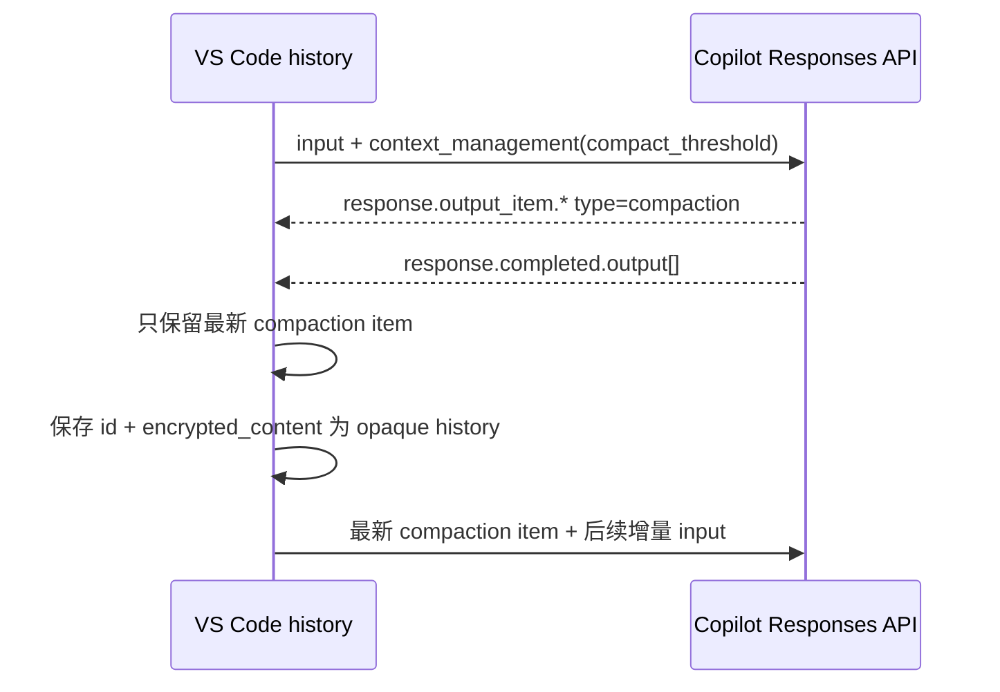

# VS Code 1.132.0 GitHub Copilot 模型 API 实现与代码架构

<!-- upstream-baseline
verified_at: 2026-08-07T10:34:19Z
repository: https://github.com/microsoft/vscode
tag: 1.132.0
revision: df53daabb18cd157bdb08c7f01c34df936cf12f4
extension: extensions/copilot
package_version: 0.60.0
copilot_api_package: 0.4.3
-->

## 1. 范围与事实边界

本文以 VS Code tag `1.132.0` 的 `extensions/copilot` 源码和测试为准，只分析 GitHub Copilot 内置模型主链。BYOK、UI 和 agent 工具只在影响 wire contract 或上下文生命周期时引用。

源码中的部分身份值会在 production build 注入，例如 `VSCODE_COPILOT_INTEGRATION_ID` 和 license 文件。本文同时核对 lockfile 固定的 `@vscode/copilot-api@0.4.3` 发布包，因此区分：

- 源码中可直接证明的 header 名称、合并顺序和默认值；
- package/tag 可证明的版本值；
- CAPI SDK 在真正发送前追加或覆盖的值；
- 只能由正式构建产物或运行环境确定的注入值。

## 2. 总体分层


| 层 | 主要文件 | 职责 |
|---|---|---|
| 模型/endpoint | `src/platform/endpoint/node/modelMetadataFetcher.ts`、`chatEndpoint.ts` | `/models` 元数据、能力、endpoint 选择、模型默认值 |
| 公共请求 | `src/extension/prompt/node/chatMLFetcher.ts` | request body 调度、动态 header、HTTP/WebSocket、retry、telemetry |
| 公共网络 | `src/platform/networking/common/networking.ts` | Authorization、request/interaction headers、API version、POST |
| CAPI SDK 桥 | `src/platform/endpoint/common/capiClient.ts` | `RequestType` 到 CAPI 请求、编辑器身份和实验 header |
| Chat | `src/platform/networking/common/networking.ts`、`openai.ts` | Chat body 和通用消息转换 |
| Responses | `src/platform/endpoint/node/responsesApi.ts` | body、history/state、compaction、SSE event 处理 |
| Messages | `src/platform/endpoint/node/messagesApi.ts`、`networking/common/anthropic.ts` | body、thinking、context editing、cache、SSE event 处理 |

## 3. 模型发现与 API 选择

`ChatEndpoint` 从 CAPI `/models` 元数据读取：

- ID、name、version、vendor、family；
- max prompt/output token；
- tool、vision、streaming、prediction、adaptive thinking；
- reasoning levels、thinking budget、tool search、context editing；
- `supported_endpoints`；
- endpoint 内部可携带的 request headers。CAPI `/models` 的 `IModelAPIResponse` schema 本身没有该字段，不能把 BYOK/内部 endpoint 扩展能力误写成账户 catalog 字段。

API 选择规则：

1. 模型支持 Responses 时优先使用 Responses。
2. 否则，在 Messages 实验开启且模型声明 Messages 时使用 Messages。
3. 其余使用 Chat Completions。

`RequestType.ChatCompletions`、`ChatResponses`、`ChatMessages` 由 `@vscode/copilot-api` CAPI client 映射到对应 Copilot endpoint。协议处理层对应 `/chat/completions`、`/responses` 和 `/v1/messages`。

## 4. 公共 HTTP 请求头

HTTP headers 分三层合并。`ChatMLFetcher` 和 `networkRequest` 先生成：

```http
Authorization: Bearer <copilot-token>
X-Request-Id: <request-uuid>
OpenAI-Intent: <location-derived-intent>
X-Interaction-Type: <override-or-intent>
X-Agent-Task-Id: <same-request-uuid>
X-Interaction-Id: <interaction-id>
X-Initiator: user|agent
X-GitHub-Api-Version: 2026-01-09
```

随后 `@vscode/copilot-api@0.4.3` 的 `_mixinHeaders` 在 CAPI 请求发送前追加身份头，并把 API version 覆盖为最终出口值：

```http
X-GitHub-Api-Version: 2026-06-01
VScode-SessionId: <runtime-session-id>
VScode-MachineId: <runtime-machine-id>
Editor-Device-Id: <runtime-device-id>
Editor-Version: vscode/1.132.0
Editor-Plugin-Version: copilot-chat/0.60.0
Copilot-Integration-Id: <build/license-derived>
```

最后 fetcher 默认添加：

```http
User-Agent: GitHubCopilotChat/0.60.0
X-VSCode-User-Agent-Library-Version: <active-fetcher-library>
```

其他规则和边界：

- `Copilot-Vision-Request:true` 只在请求包含 image 且 endpoint 支持 vision 时添加。
- endpoint 级 headers 最后合并，可添加模型 metadata headers 和 Anthropic beta。
- production build 通常解析为 `vscode-chat`，但 integration ID、session/machine/device ID 和 fetcher library version 依赖构建或运行环境，不能由代理插件伪造为真实 VS Code 实例。
- Responses WebSocket 主链使用单独的 API version `2025-05-01`；本插件当前只有 HTTP transport，不能把该值混入 HTTP 对齐。

`X-Initiator` 来自调用方明确传入的 `userInitiatedRequest`，不是根据最后一条消息 role 猜测。`OpenAI-Intent` 和 `X-Interaction-Type` 来自 `ChatLocation` 或受控 override。

## 5. `/chat/completions`

### 5.1 请求 body

基础 body 由 `createCapiRequestBody` 生成：

```json
{
  "messages": [],
  "model": "<model>"
}
```

然后合并调用方的 post options，所以 `stream`、tools、temperature 等是否出现取决于具体 fixture。模型层还会：

- 不支持 tools 时删除 `tools`；
- 不支持 streaming 时强制 `stream:false`；
- o1 family 把 system 转为 user；
- 对声明 reasoning levels 的模型发送合法的顶层 `reasoning_effort`；
- Gemini 3 可按实验设置 low effort/function calling mode；
- Kimi 规范化 tool call ID，并强制 `temperature:1`、`top_p:0.95`。

VS Code 1.132.0 不再把所有 Chat `reasoning_effort` 无条件删除。

### 5.2 响应

- streaming 由通用 CAPI SSE processor 处理 choices、tool calls、usage 和 finish reason。
- 不支持 streaming 的模型走 JSON non-stream processor。
- Copilot endpoint 会保存 response 中的 reasoning opaque ID/text，供后续历史使用。

## 6. `/responses`

### 6.1 请求 body 条件

`createResponsesRequestBody` 没有一个脱离 fixture 的固定 golden JSON。字段条件如下：

| 字段 | 规则 |
|---|---|
| `model`、`input`、`stream:true`、`store:false` | 始终生成 |
| `include:["reasoning.encrypted_content"]` | 始终生成 |
| `truncation` | 配置开启时 `auto`，否则 `disabled` |
| `max_output_tokens` | 来自 post option；没有值时从 JSON 省略 |
| `tools` | 至少有一个最终 tool 时出现，否则省略 |
| `reasoning.effort` | endpoint 声明 reasoning levels 时出现，默认候选为 `medium` |
| `text.verbosity` | 模型和实验允许时出现 |
| `prompt_cache_options` | 模型 capability 决定；mode 再受实验控制 |
| `prompt_cache_key` | 实验开启且有 conversation ID 时出现 |
| `context_management` | context-management 实验开启且 family 不在排除集合时出现 |

其他行为：

- function tool 使用 `type:function`、`strict:false` 和 object schema。
- object `tool_choice` 转成 `{type:"function",name:"..."}`。
- logprobs 请求映射为 `top_logprobs:3`。
- 可发送 `text.verbosity`、`prompt_cache_options` 和 `prompt_cache_key`。
- user/system content 使用 `input_text`、`input_image`、`input_file`；assistant history 使用 `output_text`。
- tool call/result 使用 `function_call`、`function_call_output`。
- 只有 ID 以 `rs` 开头且带 encrypted payload 的 reasoning item 才回传，防止外协议 opaque data 导致 400。

### 6.2 stateful marker

完成响应的 `response.id` 会保存为 stateful marker。下一轮可设置：

```json
{
  "previous_response_id": "resp_...",
  "input": ["只包含 marker 之后的增量历史"]
}
```

mode 改变、显式 ignore、summary 状态与 WebSocket connection 不一致时会禁用 marker 并重放完整历史。

### 6.3 服务端 context compaction

启用 `ResponsesApiContextManagementEnabled` 且 model family 不在 `gpt-5`、`gpt-5.1`、`gpt-5.2` 排除集合时，body 增加：

```json
{
  "context_management": [
    {
      "type": "compaction",
      "compact_threshold": 90000
    }
  ]
}
```

阈值为：

$$
\text{compactThreshold}=\left\lfloor 0.9\times\text{modelMaxPromptTokens}\right\rfloor
$$

prompt window 无有效值时回退 50000。

完整闭环由 VS Code 客户端持有，不由 provider endpoint 持有：



实现约束：

1. compaction item 可从 `response.output_item.*` 或 terminal `response.output[]` 到达。
2. 同一响应只保留 output index 最大的最新 item。
3. 重复的相同 id/encrypted content 不重复通知。
4. 下一轮从最新 compaction 所在历史开始切片。
5. 即使 `previous_response_id` marker 晚于 compaction，也必须把最新 compaction item 前置回传。
6. terminal output 会删除旧 compaction item，只保留最新一个。
7. server compaction 开启时，agent 层关闭独立的客户端 history summarization，避免两套压缩同时改写上下文。

对 stateless 代理而言，可移植目标是保持上述 client-managed state 的 wire 完整性；latest-item 选择、history slicing、marker 与 summary 生命周期仍属于调用客户端。

### 6.4 Responses 事件

processor 明确处理：

- `response.output_text.delta`；
- reasoning summary 和 encrypted reasoning；
- function/tool-search call；
- compaction item；
- `response.completed`；
- `response.incomplete`；
- `response.failed`；
- 顶层 `error`。

`response.completed` 还保存 stateful marker、usage、cached/reasoning tokens。`response.incomplete` 区分 max output、content filter 和未知中断；`response.failed`/`error` 映射为 server error。

## 7. `/v1/messages`

### 7.1 请求 body

`createMessagesRequestBody` 始终生成 `model`、转换后的 `messages` 和 stream 值；`system`、`tools`、`max_tokens`、`thinking`、`output_config`、`context_management` 都按输入、capability 和配置条件出现，没有空对象或零值默认 body。

关键规则：

- system 独立为 text block；同 role 相邻消息合并。
- tool schema 强制 object、补 properties、删除 `$schema`，保留 `$defs` 等合法字段。
- tool call ID 只保留 ASCII 字母、数字、下划线和连字符，并维持 call/result 配对。
- assistant thinking/signature 和 redacted thinking 正确回传；合并 assistant 时只保留一个 response 的 thinking blocks。
- adaptive model 使用 `{type:"adaptive",display:"summarized"}`；budget model 受 min/max/max_tokens 限制。
- reasoning effort 只有在 thinking 开启且模型声明支持时进入 `output_config.effort`。
- trailing assistant 会追加合成 user `Please continue.`，避免 Anthropic prefill 400。
- system、最后一个非 deferred tool、最近两个可缓存 message block 设置 cache breakpoint，总数最多 4 个。

### 7.2 headers 与 context editing

Messages endpoint 可添加：

- `interleaved-thinking-2025-05-14`；
- `advanced-tool-use-2025-11-20`；
- `context-management-2025-06-27`；
- `extended-cache-ttl-2025-04-11`。

各 beta 的 pinned VS Code gate 不相同：

- 非 adaptive Messages endpoint 发送 `interleaved-thinking-2025-05-14`；它尚未按本次 body 是否真正开启 thinking 收紧，源码 TODO 记录了这个差异。
- endpoint `supportsToolSearch` 时发送 `advanced-tool-use-2025-11-20`，不检查当前 body 是否实际包含 tool search。
- `isAnthropicContextEditingEnabled(...)` 的 capability、configuration 与 experiment 判断通过时发送 `context-management-2025-06-27`。
- `isExtendedCacheTtlEnabled(...)` 根据 endpoint、configuration、experiment、location 和 subagent 状态判断 `extended-cache-ttl-2025-04-11`；该 helper 与 body 侧 gate 共用。

本插件没有 VS Code 的 experiment/location 生命周期，因此采用更严格的 provider policy：advanced tool use 还要求 body 实际使用 tool search，context management 还要求 body 实际存在该字段，extended TTL 还要求 body 实际包含 `ttl:"1h"`。这是本地收紧策略，不是上游实现事实。

Anthropic context editing 可生成：

- `clear_thinking_20251015`，保留最近 1 个 thinking turn；
- `clear_tool_uses_20250919`，输入达到 100000 tokens 时保留最近 3 个 tool uses。

### 7.3 响应

processor 处理 message/content block start/delta/stop、thinking/signature、tool JSON delta、usage、context management 和 stop reason，并输出统一 completion。

## 8. 上游测试锚点

| 行为 | 测试 |
|---|---|
| endpoint/model capability | `src/platform/endpoint/node/test/copilotChatEndpoint.spec.ts` |
| Responses body/history/compaction | `src/platform/endpoint/node/test/responsesApi.spec.ts` |
| Responses tool search | `src/platform/endpoint/node/test/responsesApiToolSearch.spec.ts` |
| Messages body/thinking/cache/tool ID | `src/platform/endpoint/test/node/messagesApi.spec.ts` |
| 公共 network headers | `src/platform/networking/test/node/networking.spec.ts` |
| Chat fetch/retry/telemetry | `src/extension/prompt/node/test/chatMLFetcher*.spec.ts` |
| Agent summarization/compaction | `src/extension/intents/node/agentIntent.ts` 及相邻测试 |

## 9. 可移植与不可直接移植

应移植到代理插件：

- 三协议 HTTP wire header/body 规则；
- 模型 capability 驱动的 endpoint 和协议参数；
- Responses compaction opaque item 的无损传输契约；
- terminal event、tool delta、usage 和错误语义；
- Anthropic body/header 联动规则。

不应直接移植：

- VS Code UI、Prompt TSX、agent tool loop；
- telemetry/GDPR 事件体系；
- WebSocket connection manager，除非 CLIProxyAPI 明确增加相同 transport；
- chat history 存储本身；代理无法凭空恢复客户端未回传的 conversation state。

## 10. 本插件采用状态

本文前九节只陈述 pinned VS Code/Copilot Chat 实现。本地采用结果以 [CURRENT_PLUGIN_ARCHITECTURE.md](CURRENT_PLUGIN_ARCHITECTURE.md) 和 [VSCODE_COPILOT_ALIGNMENT_PLAN.md](VSCODE_COPILOT_ALIGNMENT_PLAN.md) 为准。

| 可移植契约 | 当前插件状态 |
|---|---|
| HTTP identity 与最终 API version | 已对齐 `0.60.0`、`1.132.0`、`2026-06-01` |
| request/task/interaction metadata | 已实现 UUID correlation、固定词表和受控 fallback |
| catalog capability 到 route | 已传播 limits、family、vision、reasoning、streaming、tool search、context editing |
| Chat / Responses / Messages body | 已按 capability 和 pinned 规则实现 contract tests |
| Responses inline context management | 默认 feature-on，可配置关闭；90% threshold 与 50000 fallback 已覆盖 |
| opaque continuation | 原生路径无损，跨格式在上游请求前 fail closed |
| terminal event 与错误语义 | normal、stream、translated、raw HTTP 均已验证；无终态不合成成功 |
| Anthropic beta/body 联动 | 只生成 pinned 四种 beta，不透传 caller 任意值 |

有意不移植 VS Code 的 conversation store、latest compaction selection、history slicing、WebSocket manager、runtime machine/session/device identity 和 telemetry。插件保持 stateless；测试中的小型 Responses 客户端只用于证明 opaque state 的两轮 wire round-trip，不会进入生产路径。

实现与文档经过 GPT-5.6 Terra 多轮 adversarial review，最终结论为 `APPROVE`，无 Critical/High/Medium finding。
