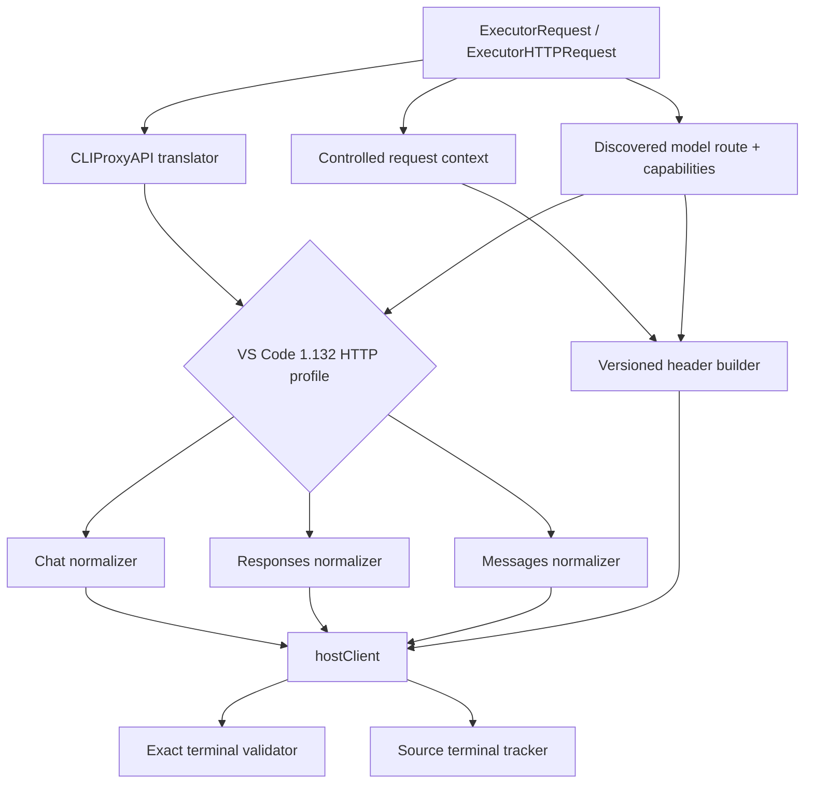

# GitHub Copilot 插件对齐 VS Code 1.132.0 的技术架构、测试与实施记录

<!-- alignment-baseline
verified_at: 2026-08-07T10:34:19Z
plugin_revision: c4b9392f4b9e9cd96180ff68abf39f1d0733eb6c
cliproxyapi_revision: 9e9230a19efc555375416d49577cdc9bcd2cc9a6
vscode_tag: 1.132.0
vscode_revision: df53daabb18cd157bdb08c7f01c34df936cf12f4
copilot_chat_version: 0.60.0
copilot_api_package: 0.4.3
status: implemented-and-verified
review_model: GPT-5.6 Terra
review_round: final
review_verdict: APPROVE
-->

## 1. 目标与结果

本轮以 VS Code `1.132.0` 内置 GitHub Copilot Chat 的 HTTP wire contract 替换了“跟随 pi 即视为正确”的旧路线。实现结果：

1. `/chat/completions`、`/responses`、`/v1/messages` 的 URL、身份、受控 metadata、能力 gate 和 body normalizer 都有版本化 contract tests。
2. 原生 Responses 的 server compaction request、opaque output、客户端 latest-item selection 和 next-turn replay 已形成自动化闭环。
3. normal、translated、streaming 和 raw HTTP 路径都要求真实 source terminal，不能由 translator 或模糊 JSON 伪造 completed。
4. endpoint、Authorization、manifest、caller header 和日志信任边界没有放宽。
5. 插件保持 stateless；公共 API、持久化、transport 和通用 translator 仍由 CLIProxyAPI 承担。

## 2. 原差异的关闭状态

| 原问题 | 最终行为 | 状态 |
|---|---|---|
| 身份仍是 Chat 0.35 / VS Code 1.107 | `GitHubCopilotChat/0.60.0`、`vscode/1.132.0`、`copilot-chat/0.60.0` | 已关闭 |
| 无 request/task correlation | 每次请求生成 UUIDv4；request/task ID 相同，interaction ID 受控 | 已关闭 |
| intent/interaction/initiator 可伪造或固定 | 固定词表、协议 fallback、`user|agent` 校验 | 已关闭 |
| route 缺少请求能力 | family、limits、vision、reasoning、streaming、tool search、context editing 贯穿 discovery/storage/route | 已关闭 |
| Chat 无条件删除 reasoning effort | 只有模型声明对应 level 时保留 | 已关闭 |
| Responses defaults 不完整 | `store:false`、缺省 truncation/include、reasoning 兼容、caller override preservation | 已关闭 |
| compaction threshold 不生成 | eligible native route 按 90% prompt window，未知 window 回退 50000 | 已关闭 |
| continuation 只是假定透传 | 测试客户端完成 output capture、latest selection 和 next-turn replay | 已关闭 |
| opaque state 可能跨格式丢失 | 请求发出前 `format_mismatch` fail closed | 已关闭 |
| `/responses/compact` 误落普通 inference | normal Alt 与 raw path 都返回 `unsupported_feature` | 已关闭 |
| stream EOF 不验证 terminal | completed/incomplete/failed/error 四类认证；无 terminal EOF 失败 | 已关闭 |
| non-stream 可接受 synthetic success | source 先验验证、精确 native grammar、重复 JSON key 拒绝 | 已关闭 |
| raw `HttpRequest` 可绕过 Responses terminal | canonical `stream:false` 复用同一 validator | 已关闭 |
| Messages beta/body gate 来源不清 | 四个 pinned beta 按 capability/body 证据生成 | 已关闭 |
| integration 只 load/discover | 真实 loader 调用 `Execute`、`ExecuteStream`、`HttpRequest` 与 host callbacks | 已关闭 |

## 3. 最终技术架构



## 4. 已实施设计决策

### D1：最小版本化 wire profile

代码只固定可由 pinned source 证明的 editor/plugin/API version、interaction vocabulary、Anthropic beta 和 Responses threshold policy。capability 和 caller context 作为独立输入；不伪造 machine/session/device ID 或 fetcher library version。

### D2：能力由账户 catalog 传播

`/models` schema、`storedModel` 和 `modelRoute` 共同携带请求构造所需能力。nullable capability 缺失时默认关闭，避免按模型名称扩大权限。compatibility manifest 只能补充账户已发现模型的白名单字段，不能改变 origin、Authorization 或最终身份。

### D3：受控 request context

- UUIDv4 同时用于 `X-Request-Id` 与 `X-Agent-Task-Id`。
- caller `X-Interaction-Id` 只有合法 UUID 才保留，否则回退 request ID。
- `X-Interaction-Type` 只接受 VS Code 1.132 固定词表；`Openai-Intent` 使用同一受控值。
- `X-Initiator` 只接受 `user|agent`；缺省时才按消息语义推断。
- caller 不能覆盖 Authorization、API version、identity 或任意 Anthropic beta。

### D4：协议 normalizer 只做可证明转换

- Chat 保留 capability 声明的合法 `reasoning_effort`，清除不支持字段并兼容 developer role。
- Responses 补齐 HTTP defaults、eligible context management 和 opaque-state guard，保留合法 caller 值。
- Messages 按 route 处理 thinking、effort、cache、tool schema/ID、context editing 和 beta，不无限增加模型 ID hardcode。

### D5：compaction 是客户端管理的 wire 契约

插件注入 eligible threshold并无损运输 opaque data，但不保存 history。测试客户端负责：

1. 收集 `response.output_item.*` 与 terminal output 中的 compaction item；
2. 选择 output index 最新 item；
3. 构造下一轮 input，并将该 item 放在增量内容之前；
4. 同时保留合法 `previous_response_id`；
5. 断言两次经过插件的 opaque id、encrypted content 和顺序不变。

任何含 stateful/compaction marker 的跨格式请求在 host HTTP 前失败。

### D6：终态由 source 授权

converter output 不能授权成功。stream source 状态优先级为：

$$
\text{failed/error} > \text{incomplete} > \text{completed}
$$

late error 覆盖早先 finish；Chat/Claude truncation reason 转成 authoritative `response.incomplete`；只有真实完成状态可发出 completed。

非流 native Responses 使用 exact grammar，并在 map 解码前递归拒绝 duplicate JSON member。normal `Execute` 与 raw canonical `POST /responses` `stream:false` 共用该 validator；合法 payload 保持原字节。

### D7：独立 compact route fail closed

VS Code `1.132.0` 只提供 inline `context_management` 证据。`Alt:"responses/compact"` 和 raw `/responses/compact` 在得到 provider endpoint 证据前固定返回 501，不改写成 `/responses`。

### D8：日志只记录结构

日志可记录 model、route、字段 presence、threshold、request ID、event type、byte count 和错误分类；不能记录 prompt、tool arguments、encrypted content、token、headers 或 upstream body。

## 5. 测试证据

### 5.1 Header 与 route

- 三协议 identity、最终 API version 和 request correlation。
- interaction vocabulary、initiator、UUID fallback 和 caller injection。
- vision 与四个 Anthropic beta 的 capability/body gate。
- discovery → storage → route 的 limits、family、reasoning、streaming、tool search 和 context editing 传播。
- streaming capability 必须显式为 true。

### 5.2 Body contract

Chat 覆盖 supported/unsupported reasoning effort、roles、tools 和 stream；Responses 覆盖 defaults、caller override、threshold、excluded family、opaque markers 与 cross-format rejection；Messages 覆盖 adaptive/budget thinking、effort、cache、tool schema/ID、context editing 和 eager input。

### 5.3 Responses terminal

测试矩阵覆盖：

- completed、incomplete、failed、error 和 missing terminal；
- finish → late error → `[DONE]` 的错误优先级；
- Chat `length`/`content_filter` 和 Claude truncation 映射；
- unknown、blank、padded、null、non-string event/status/object；
- wrapper 与 nested response 矛盾、completed 带 error、failed 无 error、incomplete 无 reason；
- root、nested、escaped-equivalent、array-contained duplicate JSON key；
- malformed/trailing JSON 与 `in_progress`；
- native payload byte identity 和所有 secret sentinel 脱敏。

### 5.4 Real host integration

`TestBuiltPluginRunsInCLIProxyHost` 构建并加载真实动态库，通过 CLIProxyAPI 的注册与 callback machinery 验证：

- registration、auth/model ownership；
- 出口 identity headers；
- non-stream `Execute` 与 streaming `ExecuteStream`；
- truncation 到 `response.incomplete` 的 reason；
- `ProviderExecutor.HttpRequest` 对 duplicate status/error raw Responses bypass 的拒绝；
- 错误不泄漏 `PRIVATE_RAW_TERMINAL_SENTINEL`。

## 6. 完成的开发阶段

### Phase 0：固定上游 contract

- [x] 固定 VS Code、Copilot Chat、CAPI SDK 和 CLIProxyAPI revision。
- [x] 固定三条 endpoint、route matrix 和 compact unsupported policy。
- [x] 建立最终 HTTP request capture、capability propagation 和 terminal fixtures。

### Phase 1：header 与 route capability

- [x] 更新 0.60/1.132 身份并保留最终 API `2026-06-01`。
- [x] 增加 request/task/interaction correlation 和受控 vocabulary。
- [x] 扩充 route capability并收紧 header/manifest 信任边界。

### Phase 2：原生 Responses 闭环

- [x] eligible threshold、caller override 和 config switch。
- [x] compaction event、latest selection、next-turn opaque replay。
- [x] compact route 拒绝与 cross-format state fail closed。
- [x] stream/non-stream/native/raw terminal 认证。

### Phase 3：三协议 body parity

- [x] Chat reasoning 与 compatibility rules。
- [x] Responses defaults、reasoning、cache 和 opaque state。
- [x] Messages thinking、cache、context、tool 和 beta 联动。

### Phase 4：集成与回归

- [x] 真实 CLIProxyAPI loader 下执行 normal、stream 和 raw paths。
- [x] auth、model、security 和 logging 回归。
- [x] full test、vet、race、format、diff 和 integration gate。
- [x] GPT-5.6 Terra 连续 adversarial review，修复至最终 `APPROVE`。

## 7. 有意差异与不支持

| 项目 | 处理 |
|---|---|
| VS Code experiment rollout | 插件以 config policy 表达，Responses context management 默认 feature-on，可关闭 |
| VS Code runtime identity | 不伪造 session/machine/device/fetcher library 值 |
| WebSocket Responses | 不实现；当前只对齐 HTTP contract |
| conversation history | 客户端负责；插件 stateless |
| `/responses/compact` | provider 未证明，明确不支持 |
| token counting | ABI 返回 `not_supported` |
| 跨格式 opaque Responses state | 不尝试有损转换，fail closed |

## 8. 验收快照

2026-08-07 最终实现快照：

- VS Code test adapter 与 uncached `go test ./...`：全部通过；
- `go vet ./...`：通过；
- `go test -race ./...`：通过；
- `gofmt` 全量检查：通过；
- `git diff --check`：通过；
- `make integration`：通过；
- GPT-5.6 Terra final review：`APPROVE`，无 Critical/High/Medium finding。

复现 gate：

```bash
make test
make vet
go test -race ./...
make integration
test -z "$(gofmt -d src/*.go)"
git diff --check
```

## 9. 完成标准

- [x] 三协议最终 URL、headers 和 JSON body 有 pinned contract tests。
- [x] Responses client-managed compaction 有两轮自动化闭环。
- [x] compact route、四类 terminal、missing terminal、truncation 和 duplicate-key ambiguity 有回归测试。
- [x] normal、stream、translated 和 raw path 不能把未授权状态伪装为 completed。
- [x] 日志、错误和 metadata 不包含 secret、prompt、tool arguments 或 encrypted compaction data。
- [x] 文档把每项差异标为已实现、宿主负责、有意不同或不支持。